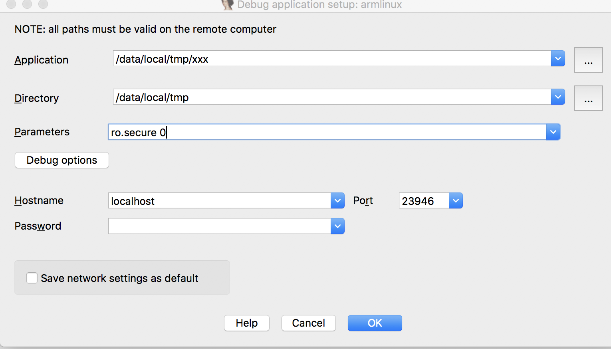

# ida调试Android原生程序

## 调试原理
利用adb调试桥将一些调试指令下发的手机端客户端，客户端收到后执行并收集调试信息，转发回来

## 调试前期准备

### 第一 准备
	+  调试so库移植到客户端,源码放在jni目录下,执行ndk-build后去obj/local/armeabi/demo找
	+  ida工具内的android_server移植到客户端
	+  修改权限

```
adb push demo /data/local/tmp/
adb push android_server /data/local/tmp/
adb shell chmod 777 /data/local/tmp/demo
adb shell chmod 777 /data/local/tmp/android_server
```

### 第二 执行

```
adb shell /data/local/tmp/android_server
```
可能会报错：error: only position independent executables (PIE) are supported.

原因是：Android4.0以后，对可执行elf格式的文件做了保护机制，可执行文件必须采用ELF方式编译，也就是在Android.mk加入以下两条代码，编译我们的源文件还好，但是第三方elf文件，如我们的android_server不能重新编译一次，可以作如下修改绕过Android的校验机制：将第17个字节的02改为03即可（elf_header e_type = et_dyn）将可执行文件类型修改为共享目标文件；具体原理可查看[这篇文章][2]

```
LOCAL_CFLAGS += -pie -fPIE
LOCAL_LDFLAGS += -pie -fPIE
```
### 第三 ida运行调试
启动ida软件，选择Debugger->run->Remote ARMLinux/Android debugger/；配置Application和路径，也就是上面我们的demo和路径；OK即可



[2]:http://blog.csdn.net/zhangmiaoping23/article/details/71159867
