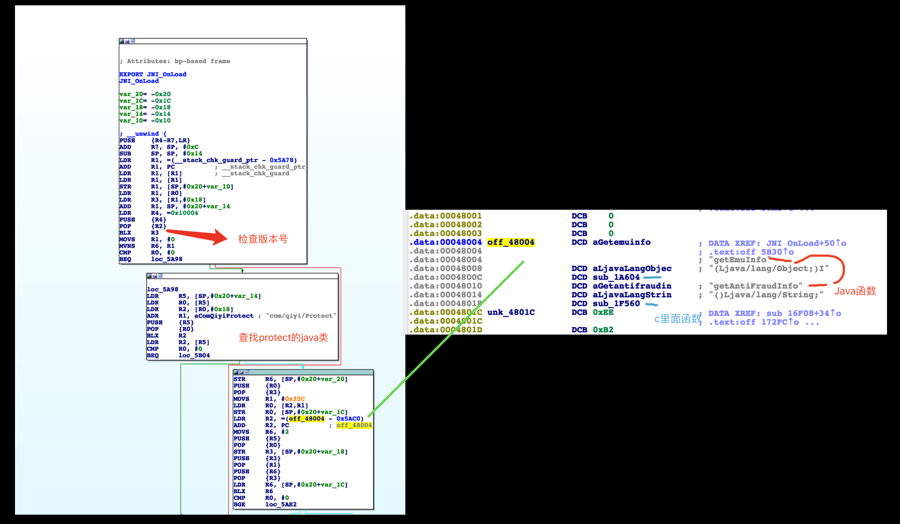

# http -- Connect方式是什么？
CONNECT方法常用于代理服务器，以代理服务器作为跳板，代理服务器访问外面的其他服务器，在把得到数据原封不动的返回给客户端；类似于翻墙代理，连接成功后，客户端就可以把代理服务器作为最终的服务器，可以进行GET和POST等方法的请求了；CONNECT请求格式如下：

## 请求

```
CONNECT www.web-tinker.com:80 HTTP/1.1
Host: www.web-tinker.com:80
Proxy-Connection: Keep-Alive
Proxy-Authorization: Basic *
Content-Length: 0
```
## 响应

```
HTTP/1.1 200 Connection Established
```


# msg.71.am是什么域名？


```
http://msg.71.am/v5/bi/opendata
qyid:352105068136291_7cd70a142b325caf_E8Z50Z8BZ30Z2FZ90

[{"v":"8.11.5","ua_model":"samsung SM-G9008W","aid":"","type":"2","device_id":"352105068136291","mac":"e8:50:8b:30:2f:90","imei":"352105068136291","openudid":"7cd70a142b325caf","androidid":"7cd70a142b325caf","bt_mac":"02:00:00:00:00:00","pkg":"com.qiyi.video","key":"591a3d5e95c34d3f4e2373d2df3fd506","sid":"qbzv7j0s70u01hwn","os_v":"6.0.1","brand":"samsung","resolution":"1080x1920","network":"1","cell_id":"169918453","gps_lon":"104.082021","gps_lat":"30.543431","tvid":"","cid":"","pid":"","duration":"17871","os_t":"Android","lang":"zh"},{"v":"8.11.5","ua_model":"samsung SM-G9008W","aid":"","type":"1","device_id":"352105068136291","mac":"e8:50:8b:30:2f:90","imei":"352105068136291","openudid":"7cd70a142b325caf","androidid":"7cd70a142b325caf","bt_mac":"02:00:00:00:00:00","pkg":"com.qiyi.video","key":"591a3d5e95c34d3f4e2373d2df3fd506","sid":"tl5ndfmwa9zs6206","os_v":"6.0.1","brand":"samsung","resolution":"1080x1920","network":"1","cell_id":"169918453","gps_lon":"104.082021","gps_lat":"30.543431","tvid":"","cid":"","pid":"","duration":"","os_t":"Android","lang":"zh"},{"v":"8.11.5","ua_model":"samsung SM-G9008W","aid":"203965201","type":"3","device_id":"352105068136291","mac":"e8:50:8b:30:2f:90","imei":"352105068136291","openudid":"7cd70a142b325caf","androidid":"7cd70a142b325caf","bt_mac":"02:00:00:00:00:00","pkg":"com.qiyi.video","key":"591a3d5e95c34d3f4e2373d2df3fd506","sid":"tl5ndfmwa9zs6206","os_v":"6.0.1","brand":"samsung","resolution":"1080x1920","network":"1","cell_id":"169918453","gps_lon":"104.082021","gps_lat":"30.543431","tvid":"692992100","cid":"-1","pid":"50a0d79ec72392387d2d477bd198d466","duration":"","os_t":"Android","lang":"zh"}]

```


## 打印object对象属性

const-string v1, "obj_"
        new-instance v2, Ljava/lang/StringBuilder;
        invoke-direct {v2}, Ljava/lang/StringBuilder;-><init>()V
	
	    invoke-virtual {v2, v1}, Ljava/lang/StringBuilder;->append(Ljava/lang/String;)Ljava/lang/StringBuilder;

	    move-result-object v2

	    invoke-virtual {v2, p0}, Ljava/lang/StringBuilder;->append(Ljava/lang/Object;)Ljava/lang/StringBuilder;

	    move-result-object v2

	    invoke-virtual {v2}, Ljava/lang/StringBuilder;->toString()Ljava/lang/String;

	    move-result-object v2
	    const-string v1, "j_tag"
	    invoke-static {v1, v2}, Landroid/util/Log;->i(Ljava/lang/String;Ljava/lang/String;)I


## 爱奇艺内部类分析

org.qiyi.android.video.MainActivity的布局使用代理类的方式掩藏了，经过分析，在MainActivity的setPresenter会进行设置代理类，为hlc,动态smali调试，发现最终的代理是在smali4里面的org.qiyi.video.homepage.f.com2的onCreate方法里面，setContentView就在这里

布局文件是：main_phone_new.xml， 里面的布局都是通过java代码添加进去的，可以在MainActivity里面findViewById找到布局主要的两个ScrollLinearLayout、ViewStub组件，在MainActivity里面分别叫：hla、hle

## org.qiyi.context.mode.nul是一个sharedpreference存储的类

## 爱奇艺签名验证

1. 解包在和包App无法连接网络，抓包发现正常http请求和和包之后的http请求缺少header头t和sign参数；可以通过grep找到sign和t位于com.qiyi.android.corejar.utils.Utility里面的getSecurityHeaderInfor方法，这个方法回去调用native的getContentJNI，native正常情况返回是一个带有&的字符串，异常就会error；正常情况参数会被分析t和sign，然后封装到map里面，最后通过Http请求出去；这个native函数在libprotect.so里面

2. 自己写个demo调用libprotect.so里面的函数，发现载入so库过程中程序就退出，目前定位发现，在libprotect.so载入时会[native动态注册][1]里面java的函数，掩藏函数名

__部分汇编：__



### 查看protect.so的汇编

getContentJNI方法进去，在1581E处进入了视图分支，就是可以看到调用框架图的点
# 解决过程中的FAQ
## ida动态调试一直获取不到客户端的进行？？？

原因就是，android_server一定要用root启动，其他用户启动不行

[1]:自己写个文档
