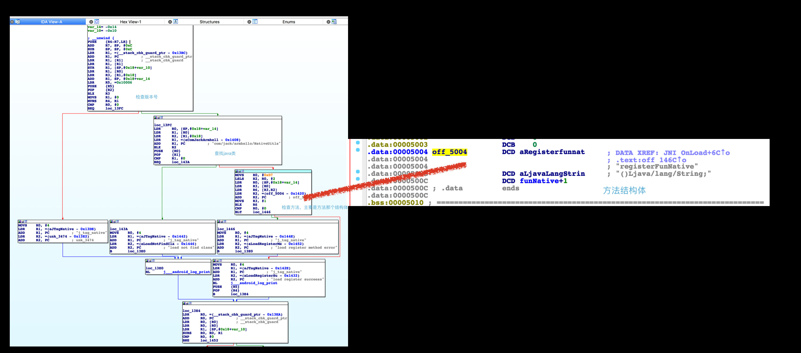

# So反调试之动态注册native函数

	jni文件夹是jni的demo
	NativeUtils是Java类

## 简介及说明

通常我们native开发的步骤是：
	1. java层声明native函数
	2. javac生class文件以及javah生成native的头文件
	3. native中会生成java的class类package路径的函数名
	4. 编写native函数实现

### 缺点

这样的做法，会暴露java层函数的具体位置，破解时，只要ida打开so文件，查看函数名，就能定位出对应Java函数的具体位置；

### 弥补上诉缺点

__使用动态注册java函数__，流程如下：

```java
public class NativeUitls {
    public static native String registerFunNative(int number);

    static {
        System.loadLibrary("test");
    }

}
```

2. 在Native中声明Java的函数名、参数返回值以及在native映射的函数

```c
/*
* java-native函数映射数组，数组参数意思分别是：
* java层函数名  Java层函数返回值  native层映射的名字
*/
static JNINativeMethod methods[]  = {{"registerFunNative", "(I)Ljava/lang/String;", (void *)funNative}};
jstring funNative(JNIEnv *env, jclass jobj, jint number);

```

3. 在JNI_OnLoad()函数中注册registerFunNative这个java函数

```c
JNIEXPORT int JNICALL JNI_OnLoad(JavaVM* vm, void* reserved){
        JNIEnv *env; 
	//检查版本号
        if((*vm)->GetEnv( vm , (void **) &env , JNI_VERSION_1_6) != JNI_OK){ 
                LOGI("load 版本不对");
                return JNI_ERR;
        }
	//查找类
        jclass javaClass = (*env)->FindClass(env, "com/jack/armhello/NativeUitls");
        if(javaClass == NULL){
                LOGI("load not find class");
                return JNI_ERR;
        }
	//注册java方法
        if((*env)->RegisterNatives(env, javaClass, methods, sizeof(methods) / sizeof(methods[0])) < 0){
                LOGI("load register method error");
                return JNI_ERR;
        }

        LOGI("load register succeess");
        return JNI_VERSION_1_6;
}

```

__这里可以做一个反调试思路，我们随机查找我们java任意一个类是否有某个native函数，如果没有就退出，（预先埋好java的native函数）__

4. 在JNI_OnUnLoad()取消函数

```c
 JNIEnv *env;
        if((*vm)->GetEnv(vm, (void **) &env , JNI_VERSION_1_6) != JNI_OK){
                LOGI("unload verson error");
        }

        jclass javaClass = (*env)->FindClass(env, "com/jack/armhello/NativeUitls");
        if(javaClass == NULL){
                LOGI("unload not find class");
        }

        if((*env)->UnregisterNatives(javaClass, javaClass) < 0){
                LOGI("unload unregister faile");
        }

        LOGI("unload unregister succeess");
```

自此，完成动态注册，这个时候用ida打开so就不会有java种注册的函数了。

# 破解这种掩藏方法

这种注册一般都是在JNI_OnLoad方法里面完成，我们只要调试这个方法即可，但是也要了解这段注册汇编长什么样子，直接看截图就行了




