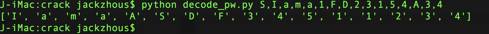

# 陕西省网络安全大赛题目一

## 简介
 输入密码打开符文

## 目的
 破解密码


## 核心

	定位到libhumen.so文件中的Java_com_humen_crackme010_CheckUtil_checkPass函数，此函数对输入字符串明文加密为密文，然后与保存在so内部密文S!@#@1FD23154A34进行比较

## 破解

	ida工具反汇编为C语言，看懂后写了一个python逆推程序，将S!@#@1FD23154A34逆推为明文，破解python脚本在当前路径下，名为：decode_pw.py

### 逆推脚本使用方法

由于没有处理好！ @ #等特殊字符，建议把这几个换位普通字符，对应为I a m
```py

	python decode_pw.py S,I,a,m,a,1,F,D,2,3,1,5,4,A,3,4
```

结果如下图所示：


